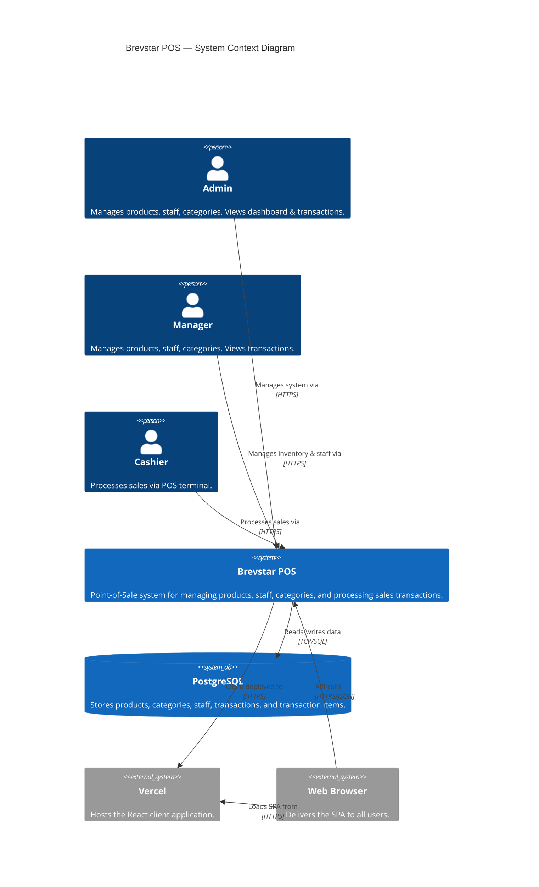

# Brevstar POS — System Context Diagram

```mermaid
C4Context
    title Brevstar POS — System Context Diagram

    Person(admin, "Admin", "Manages products, staff, categories. Views dashboard & transactions.")
    Person(manager, "Manager", "Manages products, staff, categories. Views transactions.")
    Person(cashier, "Cashier", "Processes sales via POS terminal.")

    System(pos, "Brevstar POS", "Point-of-Sale system for managing products, staff, categories, and processing sales transactions.")

    SystemDb(db, "PostgreSQL", "Stores products, categories, staff, transactions, and transaction items.")
    System_Ext(vercel, "Vercel", "Hosts the React client application.")
    System_Ext(browser, "Web Browser", "Delivers the SPA to all users.")

    Rel(admin, pos, "Manages system via", "HTTPS")
    Rel(manager, pos, "Manages inventory & staff via", "HTTPS")
    Rel(cashier, pos, "Processes sales via", "HTTPS")
    Rel(pos, db, "Reads/writes data", "TCP/SQL")
    Rel(pos, vercel, "Client deployed to", "HTTPS")
    Rel(browser, vercel, "Loads SPA from", "HTTPS")
    Rel(browser, pos, "API calls", "HTTPS/JSON")
```
