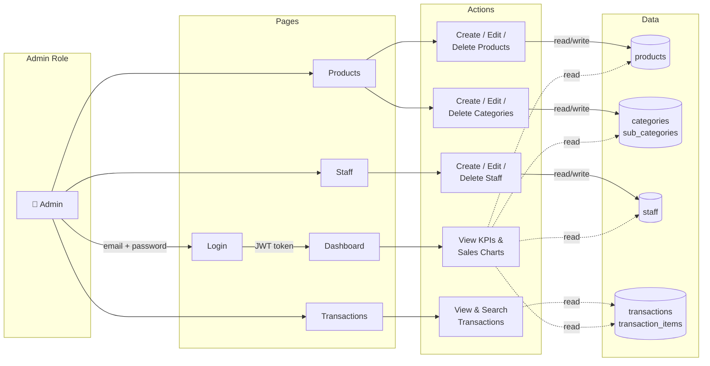
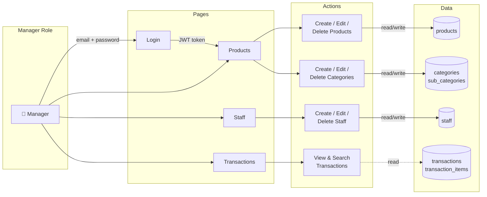
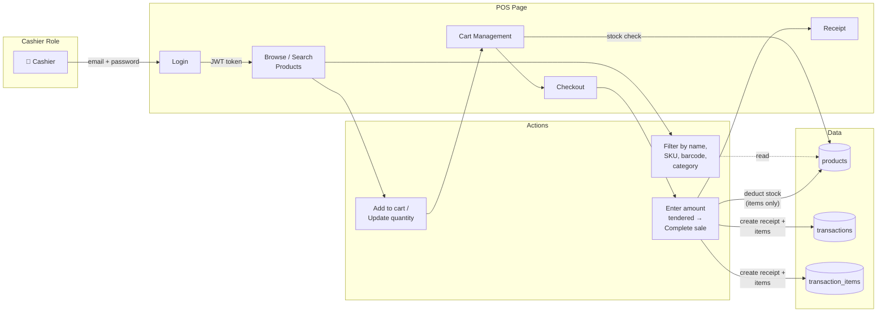

# Brevstar POS — Data Flow by Role

## Admin

```mermaid
flowchart LR
    subgraph Admin Role
        A["👤 Admin"]
    end

    subgraph Pages
        Login["Login"]
        Dash["Dashboard"]
        Prod["Products"]
        Staff["Staff"]
        Txn["Transactions"]
    end

    subgraph Actions
        ViewKPIs["View KPIs &\nSales Charts"]
        CRUD_Prod["Create / Edit /\nDelete Products"]
        CRUD_Cat["Create / Edit /\nDelete Categories"]
        CRUD_Staff["Create / Edit /\nDelete Staff"]
        ViewTxn["View & Search\nTransactions"]
    end

    subgraph Data
        ProdTbl[("products")]
        CatTbl[("categories\nsub_categories")]
        StaffTbl[("staff")]
        TxnTbl[("transactions\ntransaction_items")]
    end

    A -->|"email + password"| Login
    Login -->|"JWT token"| Dash

    Dash --> ViewKPIs
    ViewKPIs -.->|"read"| ProdTbl & CatTbl & StaffTbl & TxnTbl

    A --> Prod
    Prod --> CRUD_Prod
    Prod --> CRUD_Cat
    CRUD_Prod -->|"read/write"| ProdTbl
    CRUD_Cat -->|"read/write"| CatTbl

    A --> Staff
    Staff --> CRUD_Staff
    CRUD_Staff -->|"read/write"| StaffTbl

    A --> Txn
    Txn --> ViewTxn
    ViewTxn -.->|"read"| TxnTbl
```

## Manager

```mermaid
flowchart LR
    subgraph Manager Role
        M["👤 Manager"]
    end

    subgraph Pages
        Login["Login"]
        Prod["Products"]
        Staff["Staff"]
        Txn["Transactions"]
    end

    subgraph Actions
        CRUD_Prod["Create / Edit /\nDelete Products"]
        CRUD_Cat["Create / Edit /\nDelete Categories"]
        CRUD_Staff["Create / Edit /\nDelete Staff"]
        ViewTxn["View & Search\nTransactions"]
    end

    subgraph Data
        ProdTbl[("products")]
        CatTbl[("categories\nsub_categories")]
        StaffTbl[("staff")]
        TxnTbl[("transactions\ntransaction_items")]
    end

    M -->|"email + password"| Login
    Login -->|"JWT token"| Prod

    M --> Prod
    Prod --> CRUD_Prod
    Prod --> CRUD_Cat
    CRUD_Prod -->|"read/write"| ProdTbl
    CRUD_Cat -->|"read/write"| CatTbl

    M --> Staff
    Staff --> CRUD_Staff
    CRUD_Staff -->|"read/write"| StaffTbl

    M --> Txn
    Txn --> ViewTxn
    ViewTxn -.->|"read"| TxnTbl
```

## Cashier

```mermaid
flowchart LR
    subgraph Cashier Role
        C["👤 Cashier"]
    end

    subgraph POS Page
        Login["Login"]
        Browse["Browse / Search\nProducts"]
        Cart["Cart Management"]
        Checkout["Checkout"]
        Receipt["Receipt"]
    end

    subgraph Actions
        Search["Filter by name,\nSKU, barcode,\ncategory"]
        AddToCart["Add to cart /\nUpdate quantity"]
        Pay["Enter amount\ntendered →\nComplete sale"]
    end

    subgraph Data
        ProdTbl[("products")]
        TxnTbl[("transactions")]
        TxnItemTbl[("transaction_items")]
    end

    C -->|"email + password"| Login
    Login -->|"JWT token"| Browse

    Browse --> Search
    Search -.->|"read"| ProdTbl

    Browse --> AddToCart
    AddToCart --> Cart
    Cart -->|"stock check"| ProdTbl

    Cart --> Checkout
    Checkout --> Pay
    Pay -->|"create receipt +\nitems"| TxnTbl & TxnItemTbl
    Pay -->|"deduct stock\n(items only)"| ProdTbl
    Pay --> Receipt
```
