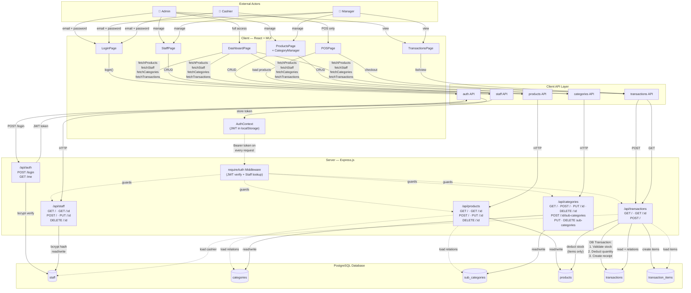

# Brevstar POS — System Data Flow

```mermaid
flowchart TB
    subgraph Actors["External Actors"]
        Admin["👤 Admin"]
        Manager["👤 Manager"]
        Cashier["👤 Cashier"]
    end

    subgraph Client["Client — React + MUI"]
        LoginPage["LoginPage"]
        Dashboard["DashboardPage"]
        ProductsPage["ProductsPage\n+ CategoryManager"]
        StaffPage["StaffPage"]
        POSPage["POSPage"]
        TxnPage["TransactionsPage"]
        AuthCtx["AuthContext\n(JWT in localStorage)"]
    end

    subgraph API["Client API Layer"]
        AuthAPI["auth API"]
        ProductAPI["products API"]
        CategoryAPI["categories API"]
        StaffAPI["staff API"]
        TxnAPI["transactions API"]
    end

    subgraph Server["Server — Express.js"]
        AuthMW["requireAuth Middleware\n(JWT verify + Staff lookup)"]
        AuthRoute["/api/auth\nPOST /login\nGET /me"]
        ProductRoute["/api/products\nGET / · GET /:id\nPOST / · PUT /:id\nDELETE /:id"]
        CategoryRoute["/api/categories\nGET / · POST / · PUT /:id · DELETE /:id\nPOST /:id/sub-categories\nPUT · DELETE sub-categories"]
        StaffRoute["/api/staff\nGET / · GET /:id\nPOST / · PUT /:id\nDELETE /:id"]
        TxnRoute["/api/transactions\nGET / · GET /:id\nPOST /"]
    end

    subgraph DB["PostgreSQL Database"]
        StaffTbl[("staff")]
        CatTbl[("categories")]
        SubCatTbl[("sub_categories")]
        ProdTbl[("products")]
        TxnTbl[("transactions")]
        TxnItemTbl[("transaction_items")]
    end

    %% Actor → Page access
    Admin -->|"full access"| Dashboard
    Admin -->|"manage"| ProductsPage
    Admin -->|"manage"| StaffPage
    Admin -->|"view"| TxnPage
    Manager -->|"manage"| ProductsPage
    Manager -->|"manage"| StaffPage
    Manager -->|"view"| TxnPage
    Cashier -->|"POS only"| POSPage

    %% Login flow
    Admin & Manager & Cashier -->|"email + password"| LoginPage
    LoginPage -->|"login()"| AuthAPI
    AuthAPI -->|"POST /login"| AuthRoute
    AuthRoute -->|"bcrypt verify"| StaffTbl
    AuthRoute -->|"JWT token"| AuthAPI
    AuthAPI -->|"store token"| AuthCtx

    %% Auth context
    AuthCtx -.->|"Bearer token on\nevery request"| AuthMW
    AuthMW -.->|"guards"| ProductRoute
    AuthMW -.->|"guards"| CategoryRoute
    AuthMW -.->|"guards"| StaffRoute
    AuthMW -.->|"guards"| TxnRoute

    %% Dashboard data
    Dashboard -->|"fetchProducts\nfetchStaff\nfetchCategories\nfetchTransactions"| ProductAPI & StaffAPI & CategoryAPI & TxnAPI

    %% Products flow
    ProductsPage -->|"CRUD"| ProductAPI
    ProductAPI -->|"HTTP"| ProductRoute
    ProductRoute -->|"read/write"| ProdTbl
    ProductRoute -.->|"load relations"| CatTbl
    ProductRoute -.->|"load relations"| SubCatTbl

    %% Categories flow
    ProductsPage -->|"CRUD"| CategoryAPI
    CategoryAPI -->|"HTTP"| CategoryRoute
    CategoryRoute -->|"read/write"| CatTbl
    CategoryRoute -->|"read/write"| SubCatTbl

    %% Staff flow
    StaffPage -->|"CRUD"| StaffAPI
    StaffAPI -->|"HTTP"| StaffRoute
    StaffRoute -->|"bcrypt hash\nread/write"| StaffTbl

    %% POS / Transaction flow
    POSPage -->|"load products"| ProductAPI
    POSPage -->|"checkout"| TxnAPI
    TxnAPI -->|"POST"| TxnRoute
    TxnRoute -->|"DB Transaction:\n1. Validate stock\n2. Deduct quantity\n3. Create receipt"| TxnTbl
    TxnRoute -->|"create items"| TxnItemTbl
    TxnRoute -->|"deduct stock\n(items only)"| ProdTbl

    %% Transactions view
    TxnPage -->|"list/view"| TxnAPI
    TxnAPI -->|"GET"| TxnRoute
    TxnRoute -->|"read + relations"| TxnTbl
    TxnRoute -.->|"load items"| TxnItemTbl
    TxnRoute -.->|"load cashier"| StaffTbl
```
