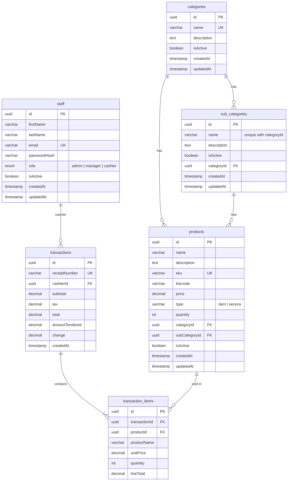

# Brevstar POS — Entity Relationship Diagram

```mermaid
erDiagram
    categories {
        uuid id PK
        varchar name UK
        text description
        boolean isActive
        timestamp createdAt
        timestamp updatedAt
    }

    sub_categories {
        uuid id PK
        varchar name "unique with categoryId"
        text description
        boolean isActive
        uuid categoryId FK
        timestamp createdAt
        timestamp updatedAt
    }

    products {
        uuid id PK
        varchar name
        text description
        varchar sku UK
        varchar barcode
        decimal price
        varchar type "item | service"
        int quantity
        uuid categoryId FK
        uuid subCategoryId FK
        boolean isActive
        timestamp createdAt
        timestamp updatedAt
    }

    staff {
        uuid id PK
        varchar firstName
        varchar lastName
        varchar email UK
        varchar passwordHash
        enum role "admin | manager | cashier"
        boolean isActive
        timestamp createdAt
        timestamp updatedAt
    }

    transactions {
        uuid id PK
        varchar receiptNumber UK
        uuid cashierId FK
        decimal subtotal
        decimal tax
        decimal total
        decimal amountTendered
        decimal change
        timestamp createdAt
    }

    transaction_items {
        uuid id PK
        uuid transactionId FK
        uuid productId FK
        varchar productName
        decimal unitPrice
        int quantity
        decimal lineTotal
    }

    categories ||--o{ sub_categories : "has"
    categories ||--o{ products : "has"
    sub_categories ||--o{ products : "has"
    staff ||--o{ transactions : "cashier"
    transactions ||--|{ transaction_items : "contains"
    products ||--o{ transaction_items : "sold in"
```
